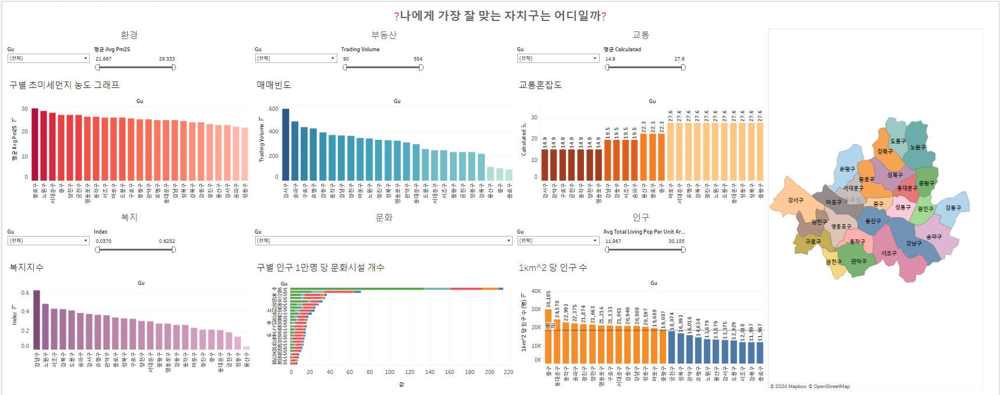
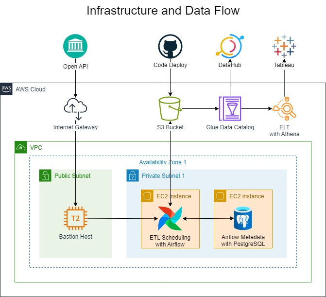

# Seoul data analysis

**Technology**: AWS Athena, AWS Glue Catalog, Apache Airflow, DataHub, Tableau
**Group**: [Programmers.co.kr](http://programmers.co.kr/) (Data Engineer Trainee)
**People**: 5 people
**Duration**: February 13, 2024 → March 10, 2024

### Objective

- Provides comprehensive **insight** on various fields of **Seoul Autonomous Districts**.
- Develop **user-friendly dashboards** for data visualization.
- Fully **automate** the data collection and analysis process.

### Design

### My Role

Provide technical direction and troubleshooting for the overall project.

- DevOps
    - Write Github Actions Workflows for CI/CD
    - Manage Jira issues for CD
- Pipeline
    - Modularize frequently used tasks and direct to seperate dags with only intervals.
    - Review and refactor the team’s code and direct to debug them
- Data Governance
    - Establish the data tiering and partitioning strategy for cost minimizing and managing.
    - Collect queries produced when performing ELT and make data lineages.

### Result

Even in a short period of time, continuous and parallel development was possible by linking Jira and Github and creating a project wiki.

Write up/downstream to view data lineage by ingesting Athena in DataHub.

By loading the S3 bucketed structure in parquet format and performing data processing only with Athena, we created an efficient design that meets the given constraints, the cost.

